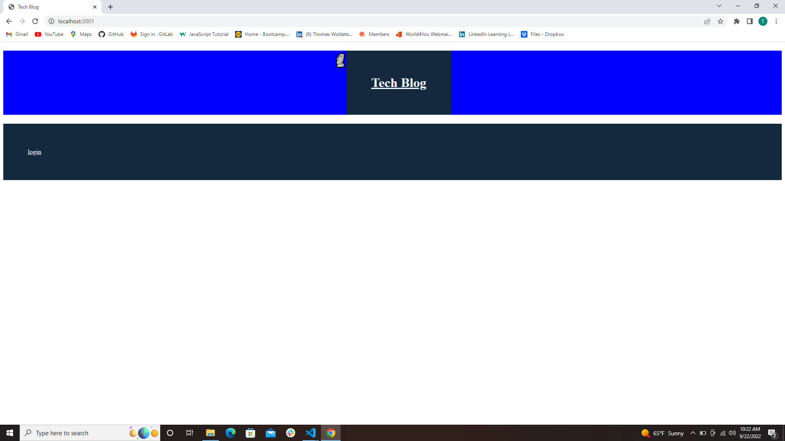
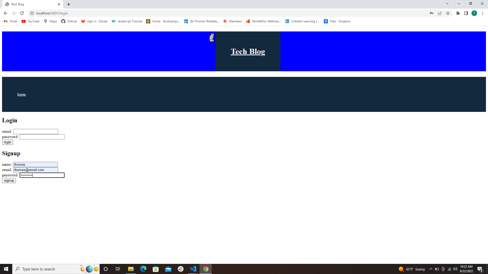

# Tech Blog

[Heroku-Link]()

## Description

this is a tech blog site, where developers can publish their blog posts and comment on other developers’ posts as well. the app follows the MVC paradigm in its architectural structure, using Handlebars.js as the templating language, Sequelize as the ORM, and the express-session npm package for authentication.
blogging about tech is very important as making it. more and more Developers spend plenty of time reading and writing about technical concepts, recent advancements, and new technologies.

## Uses

developers who writes about tech can publish articles, blog posts, and their thoughts and opinion
when the user visits the site for the first time then the user presented with the homepage, which
includes existing blog posts if any have been posted;,navigation links for the homepage and the dashboard;
and the option to log in.when the user click on the homepage option.
then the user taken to the homepage,when the user click on any other links in the navigationthen the user
prompted to either sign up or sign in.
when the user choose to sign up. then the user prompted to create a username and password
the user click on the sign-up button,then the user credentials are saved and the user logged into the site
when the user revisit the site at a later time and choose to sign in,then the user prompted to enter  
username and password. when the user signed in to the site,then the user sees navigation links for the homepage,
the dashboard, and the option to log out. when the user click on the homepage option in the navigation,then the
user taken to the homepage and presented with existing blog posts that include the post title and the date created,
when the user click on an existing blog post,then the user presented with the post title, contents, post creator’s
username, and date created for that post and have the option to leave a comment. when the user enters a comment and
click on the submit button while signed in, then the comment is saved and the post is updated to display the comment,
the comment creator’s username, and the date created. when the user click on the dashboard option in the navigation,then
the user taken to the dashboard and presented with any blog posts that the user already created and the option to add a
new blog post.when the user click on the button to add a new blog post.then the user prompted to enter both a title and
contents for the users blog post.when the user click on the button to create a new blog post,then the title and contents
of the user post are saved andthe user taken back to an updated dashboard with new blog post. when the user click on one
of his or her existing posts in the dashboard, then the user able to delete or update the post and taken back to an
updated dashboard. when the user click on the logout option in the navigation,then the user signed out of the site.when
the user idle on the site for more than a set time, then the user able to view comments but the user prompted to log in
again before can add, update, or delete comments
